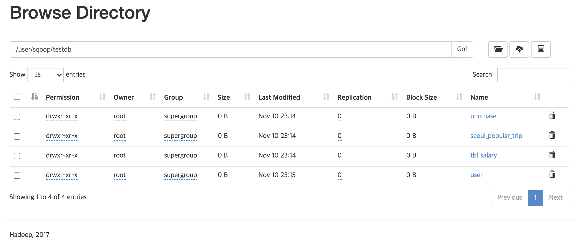
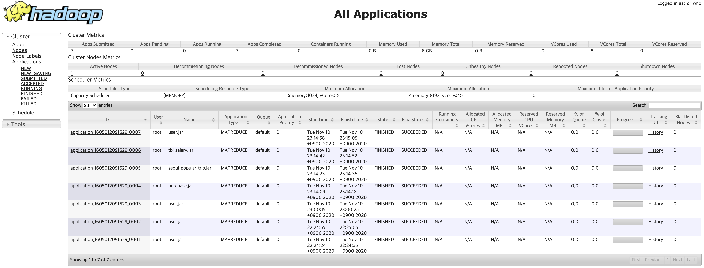
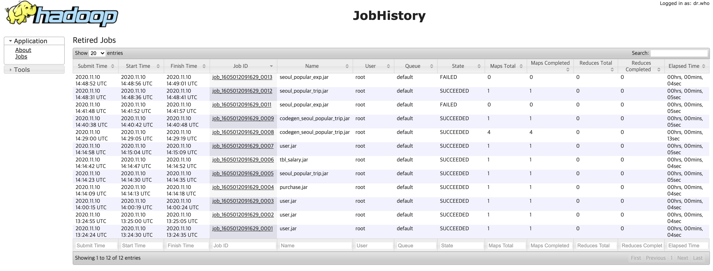

# 데이터 엔지니어링 초급 2일차
> 데이터 처리 및 분석의 가장 처음 과정인 데이터 수집 도구를 이용한 데이터 적재를 실습합니다.
> 관계형 데이터베이스 수집을 위한 Apache Sqoop, 파일 데이터 수집을 위한 TreasureData Fluentd 를 이용해 실습합니다
> 이번 장에서 사용하는 외부 오픈 포트는 22, 80, 5601, 8080, 9880, 50070 입니다

- 목차
  * [0. SQL 기초 명령어](#0-SQL-기초-명령어)
  * [1. Apache Sqoop Table Import](#1-Apache-Sqoop-Table-Import)
  * [2. Apache Sqoop Table Export](#2-Apache-Sqoop-Table-Export)
  * [3. TreasureData Fluentd File Collect](#3-TreasureData-Fluentd-File-Collect)


## 서버 기동 및 프로세스 확인
```bash
bash> cd ~/workspace/data-engineer-basic-training/day2
bash> docker-compose up -d
bash> docker-compose ps
```

## 0. SQL 기초 명령어
* mysql 서버로 접속
```bash
bash> docker-compose exec mysql mysql -usqoop -psqoop
mysql> use testdb;
```

* CREATE TABLE
```sql
CREATE TABLE table1 (
    col1 INT NOT NULL,
    col2 VARCHAR(10)
);

CREATE TABLE table2 (
    col1 INT NOT NULL AUTO_INCREMENT,
    col2 VARCHAR(10) NOT NULL,
    PRIMARY KEY (col1)
);
```

* SELECT
```sql
SELECT col1, col2
FROM table1;

SELECT col2
FROM table2
WHERE col1 = '찾는값'
```

* INSERT
```sql
INSERT INTO table1 ( col1 ) VALUES ( 1 );
INSERT INTO table2 VALUES ( 1, 'one' );
INSERT INTO table2 VALUES ( 2, 'two' ), ( 3, 'three' );
```

* UPDATE
```sql
UPDATE table1 SET col1 = 100 WHERE col1 = 1;
```

* DELETE
```sql
DELETE FROM table1 WHERE col1 = 100;
DELETE FROM table2;
```


## 1. Apache Sqoop Table Import
* 대상 서버에 접속하기 위해 도커 컴포즈를 이용하여 서버를 기동합니다
```bash
bash> cd ~/workspace/data-engineer-basic-training/day2
bash> git pull
bash> docker-compose up -d
bash> docker-comopse ps
```

### 1.1 데이터베이스, 테이블 이름 조회
* sqoop 서버에 접속하여 list-databases, list-tables, eval 명령어를 이용하여 조회합니다
```bash
bash> docker-compose exec sqoop bash

$> sqoop list-databases --connect jdbc:mysql://mysql:3306 --username sqoop --password sqoop
$> sqoop list-tables --connect jdbc:mysql://mysql:3306/testdb --username sqoop --password sqoop

$> sqoop eval --connect jdbc:mysql://mysql:3306/testdb --username sqoop --password sqoop -e "describe user"
$> sqoop eval --connect jdbc:mysql://mysql:3306/testdb --username sqoop --password sqoop -e "select * from user"
$> sqoop eval --connect jdbc:mysql://mysql:3306/testdb --username sqoop --password sqoop -e "select * from purchse"
```

### 1.2 테이블 조인, DDL, DML 명령어 수행
* eval 명령어를 이용하면 Join, Create, Insert, Select 등 DDL, DML 명령을 수행할 수 있습니다
  - 실제 테이블 수집 시에도 다수의 테이블 대신 Join 한 결과를 사용하는 경우 효과적인 경우도 많습니다
```bash
$> sqoop eval --connect jdbc:mysql://mysql:3306/testdb --username sqoop --password sqoop \
    -e "select u.*, p.* from user u join purchase p on (u.u_id = p.p_uid) limit 10"

$> sqoop eval --connect jdbc:mysql://mysql:3306/testdb --username sqoop --password sqoop \
    -e "create table tbl_salary (id int not null auto_increment, name varchar(30), salary int, primary key (id))"

$> sqoop eval --connect jdbc:mysql://mysql:3306/testdb --username sqoop --password sqoop \
    -e "insert into tbl_salary (name, salary) values ('suhyuk', 10000)"

$> sqoop eval --connect jdbc:mysql://mysql:3306/testdb --username sqoop --password sqoop \
    -e "select * from tbl_salary"

$> sqoop eval --connect jdbc:mysql://mysql:3306 --username sqoop --password sqoop \
    -e "show databases"

$> sqoop eval --connect jdbc:mysql://mysql:3306/testdb --username sqoop --password sqoop \
    -e "show tables"
```
#### 실습#1. 다음과 같은 스키마를 가진 테이블을 sqoop eval 명령어를 통해 student 테이블을 생성하세요
* 데이터베이스: testdb
* 테이블 이름: student 

| 컬럼명 | 컬럼유형 | 데이터 예제 |
| - | - | - |
| no | int | 1~44 사이의 숫자, 본인의 EC2 인스턴스 번호 |
| name | varchar(50) | 박수혁 |
| email | varchar(50) | suhyuk.park@gmail.com |
| age | int | 30 | 나이 |
| gender | varchar(10) | 남 |


#### 실습#2. sqoop eval 명령어를 통해 student 테이블에 임의의 데이터를 입력하세요 
* 아래의 목록을 이용하여 5명의 학생 레코드를 입력하세요
```text
권보안,Kwon.Boan@lgde.com,18,여
민의주,Min.Euiju@lgde.com,20,여
김혀시,Kim.Hyeosi@lgde.com,20,남
김유은,Kim.Yueun@lgde.com,38,여
박윤미,Park.Yoonmi@lgde.com,27,여
박예하,Park.Yeha@lgde.com,30,남
이병하,Lee.Byungha@lgde.com,21,남
김휘비,Kim.Hwibi@lgde.com,38,남
박재문,Park.Jaemoon@lgde.com,49,남
우소은,Woo.Soeun@lgde.com,30,여
```

### 1.3 로컬 모드 테이블 수집
* **"로컬 모드"** 란? 분산 저장/처리 엔진을 이용하지 않고 실행되는 장비의 리소스만을 이용하여 로컬 디스크에 저장할 수 있는 모드입니다
  - "-fs local" 옵션 : File System 이 local 모드임을 의미 (로컬 저장소에 저장)
  - "-jt local" 옵션 : Job Tracker 가 local 모드임을 의미 (로컬 리소스를 사용)
  - "--as-parquetfile" 옵션 : 텍스트 파일 대신, 스키마를 포함한 색인이 포함된 압축 파일 포맷 (바이너리 포맷)
```bash
$> sqoop import \
    -fs local \
    -jt local \
    -m 1 \
    --connect jdbc:mysql://mysql:3306/testdb \
    --table user \
    --target-dir file:///tmp/target/table/user/20201025 \
    --username sqoop \
    --password sqoop \
    --relaxed-isolation \
    --as-parquetfile \
    --delete-target-dir

$> # parquet 포맷으로 저장
$> sqoop import -jt local -m 1 --connect jdbc:mysql://mysql:3306/testdb --table purchase \
    --target-dir file:///tmp/target/table/purchase/20201025 --username sqoop --password sqoop \
    --relaxed-isolation --as-parquetfile --delete-target-dir

$> ls /tmp/target/table/*/20201025/*.parquet

$> # tab 구분자 포맷으로 저장
$> sqoop import -jt local -m 1 --connect jdbc:mysql://mysql:3306/testdb --table user \
    --target-dir file:///tmp/target/table/purchase_tsv/20201025 --username sqoop --password sqoop \
    --fields-terminated-by '\t' --relaxed-isolation --delete-target-dir

```

#### 실습#3. 실습#1 에서 생성했던 student 테이블을 로컬 경로에 수집하세요
* testdb.student 테이블을 /tmp/target/table/student/20201124 경로에 csv 포맷으로 저장하세요
  - 탭이 아니라 콤마(,) 구분자로 저장합니다


### 1.4 파케이 포맷 파일 읽기
* 파케이 포맷으로 저장된 테이블을 수집하고 출력합니다 
  - 파케이 포맷의 파일은 바이너리 포맷이라 cat 혹은 vi 등으로 내용을 확인할 수 없습니다
  - 서버에 설치된 /jdbc/parquet-tools-1.8.1.jar 어플리케이션을 이용하여 확인이 가능합니다
```bash
$> sqoop import -jt local -m 1 --connect jdbc:mysql://mysql:3306/testdb --table seoul_popular_trip \
    --target-dir file:///tmp/target/table/seoul_popular_trip --username sqoop --password sqoop \
    --relaxed-isolation --as-parquetfile --delete-target-dir

$> hadoop jar /jdbc/parquet-tools-1.8.1.jar head file:///tmp/target/table/seoul_popular_trip
```

* 파케이 포맷 도구를 이용하여 사용가능한 기능
  - head -n 5 : 상위 5개의 문서를 출력합니다 (default: 5)
  - cat : 문서를 그대로 출력합니다
  - schema : 테이블 스키마를 출력합니다
  - meta : 파케이 포맷의 메타데이터를 출력합니다 
  - dump : 텍스트 포맷으로 출력 합니다
```bash
$> hadoop jar /jdbc/parquet-tools-1.8.1.jar head -n 10 file:///tmp/target/table/seoul_popular_trip

$> hadoop jar /jdbc/parquet-tools-1.8.1.jar schema file:///tmp/target/table/seoul_popular_trip

$> hadoop jar /jdbc/parquet-tools-1.8.1.jar meta file:///tmp/target/table/seoul_popular_trip
```

### 1.5 클러스터 모드에서 테이블 수집
* **"클러스터 모드"** 란? 분산 저장/처리 엔진을 활용하여 원격지 장비의 리소스를 활용하여 원격 디스크에 저장할 수 있는 모드입니다
  - "-fs namenode:port" 옵션 : File System 이 분산 파일시스템 의미 (Ex. HDFS)
  - "-jt jobtracker:port" 옵션 : Job Tracker 가 분산 처리시스템 의미 (Ex. YARN)
  - 본 예제에서는 관련 설정이 되어 있으므로 -fs, -jt 옵션을 지정하지 않아도 됩니다
  - 저장경로의 경우에도 hdfs:// 는 명시하지 않아도 hdfs 에 저장됩니다
```bash
$> sqoop import -m 1 --connect jdbc:mysql://mysql:3306/testdb --table user \
    --target-dir /user/sqoop/user_append --username sqoop --password sqoop \
    --fields-terminated-by '\t' --relaxed-isolation --delete-target-dir

$> hadoop fs -cat /user/sqoop/user_append/part-m-00000
```

#### 실습#4. 실습#3 에서 생성했던 student 테이블을 클러스터 모드로 하둡 경로에 수집하세요
* testdb.student 테이블을 /user/sqoop/student/20201124 경로에 tsv 포맷으로 저장하세요
  - 콤마(,) 구분자가 아니라 탭(\t) 구분자입니다


### 1.6 기본 하둡 명령어 실습
* 하둡 분산 저장시스템에 존재하는 파일을 읽고, 쓰기 위해서는 hadoop 명령어를 이용해야 합니다
  - hadoop fs -cat <uri> : 경로의 파일을 읽습니다
  - hadoop fs -ls <uri> : 경로의 목록을 출력합니다
  - hadoop fs -mkdir -p <uri> : 경로를 하위 경로(p)까지 생성(mkdir)합니다
  - hadoop fs -cp <from> <to> : 경로의 파일을 복사합니다
  - hadoop fs -mv <from> <to> : 경로의 파일을 이동합니다
```bash
$> hadoop fs -ls /user/sqoop/user_append/part-m-00000
$> hadoop fs -mkdir -p /user/sqoop/foo/bar
$> hadoop fs -cp /user/sqoop/user_append/part-m-00000 /user/sqoop/foo/bar
$> hadoop fs -cat /user/sqoop/foo/bar/part-m-00000
```

#### 실습#5. 실습#4 에서 적재한 하둡 경로에 저장된 tsv 파일을 확인하고 마지막 학생의 이름은?
* 하둡 ls 명령어를 통해서 저장된 경로에 어떤 이름의 파일이 존재하는지 확인합니다
* 하둡 cat 명령어를 통해서 마지막에 출력되는 학생의 이름을 확인합니다


### 1.7 조건문을 통한 테이블 수집
* "--table" 옵션과 더불어 "--where" 옵션을 통해 부분 수집이 가능합니다
  - 사전에 eval 명령으로 데이터 값의 범위를 파악할 수 있습니다
  - 부분수집 결과를 바로 확인하기 위해 user\_append 경로에 텍스트 파일로 저장합니다
```bash
$> sqoop eval --connect jdbc:mysql://mysql:3306/testdb --username sqoop --password sqoop \
    -e "select min(u_id), max(u_id) from user"

$> sqoop import -m 1 --connect jdbc:mysql://mysql:3306/testdb --table user \
    --where "u_id < 5" \
    --target-dir /user/sqoop/user_append --username sqoop --password sqoop \
    --fields-terminated-by '\t' --relaxed-isolation --delete-target-dir

$> hadoop fs -cat /user/sqoop/user_append/part-m-00000

```

### 1.8 덮어쓰지 않고 추가하기
* 기본은 Overwrite 모드인데, --append 옵션을 주는 경우 원본 파일은 그대로 두고 파티션 파일이 추가됩니다
  - "--append" 모드는 중복 데이터 적재 가능성이 있으므로 주의해서 사용해만 합니다
  - "--append" 모드는 파일시스템이 HDFS 인 경우에만 지원합니다
```bash
$> sqoop import -m 1 --connect jdbc:mysql://mysql:3306/testdb --table user \
    --where "u_id >= 5" \
    --target-dir /user/sqoop/user_append --username sqoop --password sqoop \
    --fields-terminated-by '\t' --relaxed-isolation --append

$> hadoop fs -cat /user/sqoop/user_append/part-m-00001
```

### 1.9 데이터베이스의 모든 테이블을 일괄 수집
* 테이블 단위로 수집을 위해서 최사위 경로 지정이 되어야 하며, primary-key 가 필요합니다
  - primary-key 가 존재해야 mapper 수를 자동으로 조정할 수 있기 때문이며, 없다면 오류가 발생합니다
  - 단, --autoreset-to-one-mapper 옵션이 있다면 primary-key 가 없어도 mapper 1개로 수집이 가능합니다
```bash
$> sqoop import-all-tables --connect jdbc:mysql://mysql:3306/testdb --warehouse-dir /user/sqoop/testdb \
    --fields-terminated-by '\t' --username sqoop --password sqoop --autoreset-to-one-mapper
```

### 1.10 수집된 하둡 파일 시스템을 웹브라우저에서 확인
* 하둡 네임노드에서 제공하는 관리도구가 50070 포트에 존재하지만, 본 실습에서는 포트 충돌을 피하기 위해 60070 포트에 띄웠습니다
  - [http://localhost:60070/explorer.html](http://localhost:60070/explorer.html#/) 에 접속하여 /user/sqoop/testdb 경로를 확인합니다


* 하둡 리소스 매니저에서 제공하는 관리도구가 8088 포트에 존재합니다
  - [http://localhost:8088/cluster](http://localhost:8088/cluster) 에 접속하여 수행되었던 작업 목록 및 상세 내역을 확인할 수 있습니다


* 하둡 히스토리 서버를 통해서 지난 작업에 대한 로그를 볼 수 있는 관리도구가 19888 포트에 존재합니다
  - [http://localhost:19888/jobhistory](http://localhost:19888/jobhistory) 에 접속하여 수행되었던 작업 목록 및 상세 내역을 확인할 수 있습니다



### 1.11 하나의 테이블을 병렬로 수행하여 성능을 향상
* 여태까지는 하나의 테이블에 하나의 작업으로만 수행했으나, 대용량 테이블의 경우 구간을 나누어 여러개의 수집을 병렬로 수행할 수 있습니다
  - "-m 4" : 한 번에 4개의 작업이 하나의 테이블을 수집할 수 있습니다. 단, 어떤 컬럼을 기준으로 나누는지 설정이 필요합니다
  - "--split-by id" : 해당 컬럼을 기준으로 min, max 값을 계산하고 4개의 파티션 범위를 정하여 수집합니다 (skewness 해결은 어렵습니다)
```bash
$> sqoop import -m 4 --split-by id --connect jdbc:mysql://mysql:3306/testdb --table seoul_popular_trip \
    --target-dir /user/sqoop/seoul_popular_trip/split_by --username sqoop --password sqoop \
    --relaxed-isolation --as-parquetfile --delete-target-dir

$> hadoop fs -ls /user/sqoop/seoul_popular_trip/split_by
```


## 2. Apache Sqoop Table Export

### 2.1 테이블 익스포트를 위한 테이블 생성 및 수집
* seoul\_popular\_exp 라는 테이블을 동일한 스키마로 생성합니다
* seoul\_popular\_trip 테이블을 seoul\_popular\_exp 라는 경로에 수집합니다
  - 단, HCatalog 를 사용하지 않는한 현재 버전의 Sqoop Export 는 Parquet 포맷을 지원하지 않습니다
```bash
$> sqoop eval --connect jdbc:mysql://mysql:3306/testdb --username sqoop --password sqoop \
    -e "create table seoul_popular_exp (category int not null, id int not null, name varchar(100), address varchar(100), naddress varchar(100), tel varchar(20), tag varchar(500)) character set utf8 collate utf8_general_ci;"

$> sqoop list-tables --connect jdbc:mysql://mysql:3306/testdb --username sqoop --password sqoop

$> sqoop import -m 1 --connect jdbc:mysql://mysql:3306/testdb --table seoul_popular_trip \
    --target-dir /user/sqoop/seoul_popular_exp --username sqoop --password sqoop \
    --fields-terminated-by '\t' --relaxed-isolation --delete-target-dir
```

#### 실습#6 실습#1 에서 생성한 테이블과 동일한 스키마를 가진 student\_exp 테이블을 생성합니다
* sqoop eval 명령어를 통해서 export 테스트를 위한 student\_exp 테이블을 생성합니다
* 데이터베이스는 마찬가지로 testdb 입니다


### 2.2 테이블 익스포트 수행
* 적재된 데이터를 익스포트 명령을 통해서 수행하였으나 실패하였고, 원인을 파악해 봅니다 
* [Hadoop History Server](http://localhost:19888/jobhistory) 에 접속하여 원인을 파악합니다
  - 실제 로그를 살펴보면 한 줄 전체를 문자열로 인식하고 넣으려다가 발생한 오류를 알게 됩니다
```bash
$> sqoop export -m 1 --connect jdbc:mysql://mysql:3306/testdb --table seoul_popular_exp \
    --export-dir /user/sqoop/seoul_popular_exp --username sqoop --password sqoop
```
* 익스포트 시에도 데이터를 읽을 때의 구분자가 지정되지 않아서 발생한 오류입니다
  - 테이블 익스포트의 경우 항상 가비지 데이터가 존재할 수 있기 때문에 반드시 사전에 truncate 작업을 수행합니다
```bash
$> sqoop eval --connect jdbc:mysql://mysql:3306/testdb --username sqoop --password sqoop \
    -e "truncate table seoul_popular_exp"

$> sqoop export -m 1 --connect jdbc:mysql://mysql:3306/testdb --table seoul_popular_exp \
    --export-dir /user/sqoop/seoul_popular_exp --username sqoop --password sqoop \
    --fields-terminated-by '\t'

$> sqoop eval --connect jdbc:mysql://mysql:3306/testdb --username sqoop --password sqoop \
    -e "select count(1) from seoul_popular_exp"

$> exit
```

#### 실습#7 hdfs:///user/sqoop/student/20201124 경로에 저장된 tsv 파일을 student\_exp 테이블에 export 합니다
* sqoop export 명령을 통해 student\_exp 테이블에 학생 이름을 적재합니다

#### 실습#8 실습#7 의 export 가 성공하면 sqoop eval 명령으로 테이블 내용을 확인합니다
* export 가 성공하면 "select count(1) from student\_exp" 질의문을 통해 학생 수를 확인합니다


## 3. TreasureData Fluentd File Collect
* 예제 실행을 위해 프로젝트 루트 폴더로 이동합니다
```bash
bash> cd ~/workspace/data-engineer-basic-training/day2
bash> pwd
/home/ubuntu/workspace/data-engineer-basic-training/day2
```

### 예제 1. 웹 서버를 통해서 전송 받은 데이터를 표준 출력으로 전달
* 서버가 정상적으로 기동 되어 있는지 확인 후 fluentd 서버로 접속합니다
```bash
bash> docker-compose ps
bash> docker-compose logs -f fluentd
bash> docker-compose exec fluentd bash
```
* vim 와 같은 편집기를 사용하지 않고 실습에 필요한 ex1.conf 파일을 생성합니다
  - 터미널 창에서 "cat > ex1.conf" 명령으로 표준입력을 받을 준비를 합니다
```bash
$> cat > ex1.conf
```
* 다음 설정 정보를 복사하여 붙여 넣은 뒤 Ctrl+C 명령으로 빠져나오면 파일이 생성됩니다
```conf
<source>
    @type http
    port 9880
    bind 0.0.0.0
</source>

<match test>
    @type stdout
</match>
```
* 생성된 설정파일을 이용하여 fluentd.sh 데몬을 기동합니다
  - fluentd.sh 명령을 그대로 실행하면 usage 가 출력됩니다
  - 방금 생성한 ex1.conf 파일을 이용하여 기동합니다
```bash
$> ./fluentd.sh 
./fluentd.sh -c <fluent.conf>
./fluentd.sh -c /etc/fluentd/fluent.conf

$> ./fluentd.sh -c ./ex1.conf
```
* 해당 fluentd 서버로 로그를 전송하기 위한 별도의 터미널을 하나 더 엽니다
```bash
bash> docker-compose exec fluentd bash
```
* curl 명령으로 fluentd 서버 동작 유무 확인 후, 종료합니다
  - 명령 실행 후에 이전 터미널에서 로그가 정상 수신된 것을 확인합니다
  - fluentd.sh 에서 Ctrl+C 명령으로 종료합니다
```bash
$> curl -i -X POST -d 'json={"action":"login","user":2}' http://localhost:9880/test
```


### 예제 2. 더미 에이전트를 통해 생성된 이벤트를 로컬 저장소에 저장
* 첫 번째 터미널에서, 예제 1번과 동일한 방식으로 ex2.conf 파일을 생성합니다
  - 방금 생성한 ex2.conf 파일을 이용하여 기동합니다
```bash
$> cat > ex2.conf
```
* 다음 설정 정보를 복사하여 붙여 넣은 뒤 Ctrl+C 명령으로 빠져나오면 파일이 생성됩니다
```bash
<source>
    @type dummy
    tag lgde.info
    size 5
    rate 1
    auto_increment_key seq
    dummy {"info":"hello-world"}
</source>

<source>
    @type dummy
    tag lgde.debug
    size 3
    rate 1
    dummy {"debug":"hello-world"}
</source>

<filter lgde.info>
    @type record_transformer
    <record>
        table_name ${tag_parts[0]}
    </record>
</filter>

<match lgde.info>
    @type file
    path_suffix .log
    path /tmp/target/ex2/${table_name}/%Y%m%d/part-%Y%m%d.%H%M
    <buffer time,table_name>
        timekey 1m
        timekey_wait 10s
        timekey_use_utc false
        timekey_zone +0900
    </buffer>
</match>
```
* 아래 명령으로 플루언트디를 기동합니다
```bash
$> ./fluentd.sh -c ./ex2.conf
```
* 두 번째 터미널에서 파일이 생성되는지 확인해 봅니다
```bash
$> ls -al /tmp/target/ex2/lgde/
```


### 예제 3. 기존 로그에 추가되는 로그를 테일링하며 표준 출력으로 전달합니다
* 동일한 방식으로 ex3.conf 파일을 생성합니다
```bash
$> cat > ex3.conf
```
* 다음 설정 정보를 복사하여 붙여 넣은 뒤 Ctrl+C 명령으로 빠져나오면 파일이 생성됩니다
```bash
<source>
    @type tail
    @log_level info
    path /tmp/source/ex3/accesslogs
    pos_file /tmp/source/ex3/accesslogs.pos
    refresh_interval 5
    multiline_flush_interval 5
    rotate_wait 5
    open_on_every_update true
    emit_unmatched_lines true
    read_from_head false
    tag weblog.info
    <parse>
        @type apache2
    </parse>
</source>

<match weblog.info>
    @type file
    @log_level info
    add_path_suffix true
    path_suffix .log
    path /tmp/target/ex3/${tag}/%Y%m%d/accesslog.%Y%m%d.%H
    <buffer time,tag>
        timekey 1h
        timekey_use_utc false
        timekey_wait 10s
        timekey_zone +0900
        flush_mode immediate
        flush_thread_count 8
    </buffer>
</match>

<match weblog.debug>
    @type stdout
    @log_level debug
</match>
```
* 아래 명령으로 플루언트디를 기동합니다
```bash
$> ./fluentd.sh -c ./ex3.conf
```
* 기존에 아파치 로그를 이용하여 로그추가를 시뮬레이션 하는 파이썬 스크립트를 생성합니다
  - 플루언트디 서버의 경우 /tmp/source/ex3, /tmp/target/ex3 경로를 각 각 입력과 출력 경로로 설정되어 있습니다
  - 로그를 생성하고 10초 대기 후 다시 반복하면서 전체 로그를 생성합니다
```python
$> cat > generate_logs.py
```
* 다음 정보를 복사하여 붙여 넣은 뒤 Ctrl+C 명령으로 빠져나오면 파일이 생성됩니다
```bash
#!/usr/bin/env python3
# lgde data-engineering-basic ex3

import sys, time, os, shutil

# 1. read apache_logs flush every 100 lines until 1000 lines
# 2. every 1000 lines file close & rename file with seq
# 3. create new accesslogs and goto 1.

def readlines(fp, num_of_lines):
    lines = ""
    for line in fp:
        lines += line
        num_of_lines = num_of_lines - 1
        if num_of_lines == 0:
            break
    return lines


fr = open("/tmp/access_log", "r")
for x in range(0, 10):
    fw = open("/tmp/source/ex3/accesslogs", "w+")
    for y in range(0, 10):
        lines = readlines(fr, 100)
        fw.write(lines)
        fw.flush()
        time.sleep(0.1)
        sys.stdout.write(".")
        sys.stdout.flush()
    fw.close()
    print("file flushed ... sleep 10 secs")
    time.sleep(10)
    shutil.move("/tmp/source/ex3/accesslogs", "/tmp/source/ex3/accesslogs.%d" % x)
    print("renamed accesslogs.%d" % x)
fr.close()
```
* 아래의 명령으로 로그를 생성하는 파이썬 프로그램을 기동합니다
```bash
$> python3 generate_logs.py
```
* 플루언트디도 기동 되었고, 파이썬 스크립트도 생성되었다면 로그를 생성합니다
  - 같이 배포되어 있는 apache\_logs 파일을 읽어서 예제 시스템 로그가 생성됩니다
  - 동시에 target 경로에는 수집된 로그가 포맷에 맞게 적재됩니다
```bash
$> ls -al /tmp/source/ex3/
$> ls -al /tmp/target/ex3/
```


### 예제 4. 변환함수를 통해 Epoch 시간을 포맷팅된 문자열 데이터로 변환
* 동일한 방식으로 ex4.conf 파일을 생성후, 플루언트디를 기동합니다
```bash
$> cat > ex4.conf
```
* 다음 설정 정보를 복사하여 붙여 넣은 뒤 Ctrl+C 명령으로 빠져나오면 파일이 생성됩니다
```bash
<source>
    @type http
    port 8080
    <parse>
        @type json
        time_type float
        time_key logtime
        types column1:integer,column2:string,logtime:time:unixtime
        localtime true
        keep_time_key true
    </parse>
</source>

<filter test>
    @type record_transformer
    enable_ruby
    <record>
        filtered_logtime ${Time.at(time).strftime('%Y-%m-%d %H:%M:%S')}
    </record>
</filter>

<match test>
    @type stdout
    <format>
        @type json
        time_format %Y-%m-%d %H:%M:%S.%L
        timezone +09:00
    </format>
</match>
```
* 아래 명령으로 플루언트디를 기동합니다
```bash
$> ./fluentd.sh -c ex4.conf
```
* 예제 데이터를 전송하고, 정상적으로 시간이 포맷팅된 문자열로 변환이 되는지 확인합니다
```bash
$> curl -X POST -d '{ "column1":"1", "column2":"hello-world", "logtime": 1593379470 }' http://localhost:8080/test
```


### 예제 5. 외부 도커 컨테이너에서 생성되는 로그를 수집할 수 있습니다
* 동일한 방식으로 ex5.conf 파일을 생성후, 플루언트디를 기동합니다
  - 플루언트디 프로세스가 외부에서 전송하는 로그를 수집하는 Aggregator 데몬 예제입니다
  - 프로세스를 하나 띄워두고, 각 도커 컨테이너에서 로그를 전송하는 방식입니다
```bash
$> cat > ex5.conf
```
* 다음 설정 정보를 복사하여 붙여 넣은 뒤 Ctrl+C 명령으로 빠져나오면 파일이 생성됩니다
```bash
<source>
    @type forward
    port 24224
    bind 0.0.0.0
</source>

<filter docker.*>
    @type parser
    key_name log
    reserve_data true
    <parse>
        @type json
    </parse>
</filter>

<filter docker.*>
    @type record_transformer
    <record>
        table_name ${tag_parts[1]}
    </record>
</filter>

<match docker.*>
    @type stdout
</match>
```
* 아래 명령으로 플루언트디를 기동합니다
```bash
$> ./fluentd.sh -c ex5.conf
```
* 현재 수집 플루언트디 에이전트가 떠 있는 서버의 IP 를 확인합니다
```bash
$> hostname -I
```
* 외부에 존재하는 서버의 도커 컨테이너가 로그를 전송하는 예제입니다
  - 별도의 터미널 창을 하나 더 열어서 도커 명령어를 실행시킬 준비를 합니다
```bash
bash> FLUENTD_IP="" # 플루언트디가 떠 있는 IP
bash> FLUENTD_PORT=24224
bash> docker run --rm --log-driver=fluentd --log-opt fluentd-address=${FLUENTD_IP}:${FLUENTD_PORT} alpine echo '{"message":"null tag message"}'
```
* 해당 컨테이너가 가진 이름 아이디를 포함해서 전송할 수 있습니다
  - .ID .Name .FullID 값들은 도커 구현 시에 포함된 사전에 정의된 값입니다
  - 전송과 동시에 플루언트디가 설치된 터미널에 해당 로그가 수신된 것을 볼 수 있습니다
```bash
bash> 
docker run --rm --log-driver=fluentd --log-opt fluentd-address=${FLUENTD_IP}:${FLUENTD_PORT} alpine echo '{"message":"null tag message"}'
docker run --rm --log-driver=fluentd --log-opt fluentd-address=${FLUENTD_IP}:${FLUENTD_PORT} --log-opt tag=docker.{{.ID}} alpine echo '{"message":"send message with id"}'
docker run --rm --log-driver=fluentd --log-opt fluentd-address=${FLUENTD_IP}:${FLUENTD_PORT} --log-opt tag=docker.{{.Name}} alpine echo '{"message":"send message with name"}'
docker run --rm --log-driver=fluentd --log-opt fluentd-address=${FLUENTD_IP}:${FLUENTD_PORT} --log-opt tag=docker.{{.FullID}} alpine echo '{"message":"send message with full-id"}'
```


### 예제 6. 하나의 장비에 여러개의 프로세스를 통한 수집작업
* 동일한 방식으로 ex6.conf 파일을 생성후, 플루언트디를 기동합니다
  - 예제에서는 "worker0"는 로컬 파일을 읽어서 저장하는 예제이고 "worker1"의 경우는 http 서버를 통해 수신하는 예제입니다
```bash
$> cat > ex6.conf
```
* 다음 설정 정보를 복사하여 붙여 넣은 뒤 Ctrl+C 명령으로 빠져나오면 파일이 생성됩니다
```bash
<system>
    workers 2
    root_dir /tmp/log
</system>
<worker 0>
    <source>
        @type tail
        path /tmp/source/ex6/*.log
        pos_file /tmp/source/ex6/local.pos
        tag worker.tail
        <parse>
            @type json
        </parse>
    </source>
    <match>
        @type stdout
    </match>
</worker>
<worker 1>
    <source>
        @type http
        port 9880
        bind 0.0.0.0
    </source>
    <match>
        @type stdout
    </match>
</worker>
```
* 아래 명령으로 플루언트디를 기동합니다
```bash
$> ./fluentd.sh -c ex6.conf
```
* 첫 번째 프로세스가 파일로 받은 입력을 표준 출력으로 내보내는 프로세스입니다
  - 임의의 파일 수집로그를 생성하기 위해, 임의의 로그를 touch 명령으로 생성합니다
  - seq 명령으로 10 개의 메시지를 생성하고, 해당 메시지가 정상 수신됨을 첫 번째 터미널에서 확인합니다
```bash
bash> touch /tmp/source/ex6/access.log
bash> for x in $(seq 1 10); do echo "{\"worker0\":\"hello world worker 0\"}" >> /tmp/source/ex6/access.log; done
``` 
* 두 번째 프로세스는 HTTP 로 입력 받은 내용을 표준 출력으로 내보내는 프로세스입니다
```bash
bash> curl -XPOST -d "json={\"worker1\":\"hello world worker 1\"}" http://localhost:9880/test
```


### 예제 7. 여러개의 프로세스가 하나의 장비에서, 하나 저장소에 저장합니다
* 동일한 방식으로 ex7.conf 파일을 생성후, 플루언트디를 기동합니다
  - 예제에서는 "worker0"는 로컬 파일을 읽어서 저장하는 예제이고 "worker1"의 경우는 http 서버를 통해 수신하는 예제입니다
```bash
$> cat > ex7.conf
```
* 다음 설정 정보를 복사하여 붙여 넣은 뒤 Ctrl+C 명령으로 빠져나오면 파일이 생성됩니다
```bash
<system>
    workers 2
    root_dir /tmp/workers
</system>

<worker 0>
    <source>
        @type http
        port 9880
        bind 0.0.0.0
    </source>
    <match debug>
        @type stdout
    </match>
    <match test>
        @type file
        @id out_file_0
        path "/tmp/target/ex7/#{worker_id}/${tag}/%Y%m%d/testlog.%H%M"
        <buffer time,tag>
            timekey 1m
            timekey_use_utc false
            timekey_wait 10s
        </buffer>
    </match>
</worker>

<worker 1>
    <source>
        @type http
        port 9881
        bind 0.0.0.0
    </source>
    <match debug>
        @type stdout
    </match>
    <match test>
        @type file
        @id out_file_1
        path "/tmp/target/ex7/#{worker_id}/${tag}/%Y%m%d/testlog.%H%M"
        <buffer time,tag>
            timekey 1m
            timekey_use_utc false
            timekey_wait 10s
        </buffer>
    </match>
</worker>
```
* 아래 명령으로 플루언트디를 기동합니다
```bash
$> ./fluentd.sh -c ex7.conf
```
* 2개의 플루언트디 프로세스에 curl 로 메시지를 전달하는 bash 스크립트를 생성 및 실행합니다
```bash
$> cat > progress.sh
```
* 다음 정보를 복사하여 붙여 넣은 뒤 Ctrl+C 명령으로 빠져나오면 파일이 생성됩니다
```bash
#!/bin/bash
max=60
dot="."
for number in $(seq 0 $max); do
    for port in $(seq 9880 9881); do
        # echo curl -XPOST -d "json={\"hello\":\"$number\"}" http://localhost:$port/test
        curl -XPOST -d "json={\"hello\":\"$number\"}" http://localhost:$port/test
    done
    echo -ne "[$number/$max] $dot\r"
    sleep 1
    dot="$dot."
done
```
* 프로그래스 파일을 실행합니다
```bash
$> chmod +x ./progress.sh
$> ./progress.sh
```
* 끝으로 /tmp/target 경로에 워커 아이디 별로 경로와 파일이 생성되었는지 확인합니다

### 모든 실습이 완료되었다면 컨테이너를 모두 종료합니다
```bash
bash> cd ~/workspace/data-engineer-basic-training/day2
bash> docker-compose down
```
